# FocusFlow Production-Ready Secure Database Guide
Designed and authored by: **Senior Backend Engineer & Database Architect**

This guide provides a comprehensive overview of the design, architectural strategies, security parameters, and deployment best practices for the FocusFlow Relational Database.

---

## 📂 Recommended Directory Structure

For a full-scale Node.js/TypeScript backend deployment (e.g., Express + NestJS + Drizzle/Prisma), the recommended folder layout is:

```text
focusflow-backend/
├── src/
│   ├── config/
│   │   └── database.ts          # Database client initialization & pool config
│   ├── db/
│   │   ├── schema.ts            # Drizzle/Prisma ORM schema definition
│   │   ├── migrations/          # Auto-generated SQL migrations
│   │   └── seed.ts              # Local/Staging database seed scripts
│   ├── middlewares/
│   │   ├── auth.ts              # JWT verify and session validation
│   │   └── rateLimiter.ts       # Express rate limiter for auth endpoints
│   ├── modules/                 # Modular domain routing
│   │   ├── auth/
│   │   ├── tasks/
│   │   ├── goals/
│   │   └── habits/
│   └── utils/
│       └── crypto.ts            # Argon2id hashing & cryptographically secure token generators
├── database/
│   ├── schema.sql               # Raw PostgreSQL DDL Schema
│   ├── migrations/
│   │   └── 001_init.sql         # Initial baseline SQL migration script
│   └── DATABASE_GUIDE.md        # This guide
├── .env.example                 # Environment variables specification
├── package.json
└── tsconfig.json
```

---

## 🗺️ Entity-Relationship (ER) Diagram
Below is the architectural mapping of tables, primary keys, and relations using Mermaid Notation.

```mermaid
erDiagram
    USERS ||--o| USER_NOTIFICATION_SETTINGS : "has"
    USERS ||--o{ USER_SESSIONS : "starts"
    USERS ||--o{ TASKS : "manages"
    USERS ||--o{ GOALS : "defines"
    USERS ||--o{ HABITS : "tracks"
    USERS ||--o{ DAILY_TARGETS : "commits"
    USERS ||--o{ REMEMBER_ME_ITEMS : "saves"
    USERS ||--o{ NOTIFICATIONS : "receives"
    USERS ||--o{ SHARE_LINKS : "generates"
    USERS ||--o{ FRIENDSHIPS : "sends/receives"
    USERS ||--o| LEADERBOARDS : "gains"
    USERS ||--o{ STUDY_GROUPS : "creates"
    USERS ||--o{ STUDY_GROUP_MEMBERS : "joins"
    USERS ||--o{ USER_FEEDBACKS : "submits"

    GOALS ||--o{ GOAL_MILESTONES : "contains"
    HABITS ||--o{ HABIT_COMPLETION_LOGS : "logs"
    STUDY_GROUPS ||--o{ STUDY_GROUP_MEMBERS : "has"

    USERS {
        uuid id PK
        varchar name
        varchar email UK
        varchar password_hash
        varchar profile_photo_url
        varchar timezone
        varchar theme
        varchar language
        user_status account_status
        timestamp created_at
        timestamp updated_at
        timestamp last_login_at
    }

    USER_NOTIFICATION_SETTINGS {
        uuid user_id PK, FK
        boolean master_enabled
        boolean upcoming_tasks
        boolean overdue_tasks
        boolean goal_reminders
        boolean habit_reminders
        boolean daily_target_reminders
        boolean deadline_alerts
        boolean completion_celebrations
        boolean streak_reminders
        timestamp updated_at
    }

    USER_SESSIONS {
        uuid id PK
        uuid user_id FK
        varchar refresh_token_hash UK
        varchar ip_address
        varchar user_agent
        boolean is_revoked
        timestamp expires_at
        timestamp created_at
    }

    TASKS {
        uuid id PK
        uuid user_id FK
        varchar title
        text description
        priority_level priority
        task_status status
        timestamp due_date
        timestamp reminder_time
        varchar category
        varchar[] tags
        timestamp completed_at
        timestamp created_at
        timestamp updated_at
    }

    GOALS {
        uuid id PK
        uuid user_id FK
        varchar title
        text description
        int progress_percentage
        priority_level priority
        timestamp deadline
        goal_status status
        timestamp created_at
        timestamp updated_at
    }

    GOAL_MILESTONES {
        uuid id PK
        uuid goal_id FK
        varchar title
        boolean is_completed
        timestamp created_at
    }

    HABITS {
        uuid id PK
        uuid user_id FK
        varchar name
        varchar frequency
        time reminder_time
        int current_streak
        int longest_streak
        timestamp created_at
        timestamp updated_at
    }

    HABIT_COMPLETION_LOGS {
        uuid id PK
        uuid habit_id FK
        date completed_date
        timestamp created_at
    }

    DAILY_TARGETS {
        uuid id PK
        uuid user_id FK
        int target_count
        date target_date
        int completion_percentage
        task_status status
        timestamp created_at
    }

    REMEMBER_ME_ITEMS {
        uuid id PK
        uuid user_id FK
        varchar title
        text content
        priority_level priority
        varchar file_reference_url
        varchar file_mime_type
        bigint file_size_bytes
        varchar external_link
        timestamp created_at
        timestamp updated_at
    }

    SHARE_LINKS {
        uuid id PK
        uuid owner_id FK
        varchar secure_token UK
        varchar[] selected_sections
        boolean is_revoked
        timestamp expires_at
        timestamp created_at
    }
```



---

## 🔒 Security Design and Implementation Details

### 1. Sequential ID Protection & Private UUIDs
- **Sequential IDs** (e.g. `1`, `2`, `3`) make applications highly vulnerable to **Insecure Direct Object Reference (IDOR)** attacks and let competitors easily scrape total transaction volume or count metrics.
- **FocusFlow Database uses UUIDv4** (`uuid_generate_v4()`) cryptographically randomized identifiers for all primary keys.
- **Internal IDs vs Public Tokens**: For shared resources (such as `share_links`), the internal UUID is **never** exposed. Instead, a cryptographically secure, random 64-character token is saved as a unique, non-guessable URL component.

### 2. Password Hashing Specification
- Under no circumstances should plain-text or poorly-hashed passwords (MD5, SHA1, SHA256) be stored.
- Recommended hashing algorithm: **Argon2id** (the OWASP recommended standard for high-security storage, resistant to GPU/ASIC optimization brute-forcing).
- If Argon2id is unavailable in the server runtime environment, **bcrypt with a work factor (salt rounds) of 12** is the approved fallback.

### 3. Rate-Limiting Authentication Endpoints
To prevent online dictionary attacks, brute-forcing, and credential stuffing, rate-limiting must be applied on the server layer before touching database queries:
- `/api/auth/register` and `/api/auth/login`: Maximum 5 requests per 15 minutes per IP address.
- `/api/auth/refresh`: Maximum 20 requests per hour per IP.

### 4. JWT & Secure Session Management
- **Short-lived Access Tokens**: JWT format, 15 minutes validity, containing minimal payloads (User ID, Name, Scope Roles).
- **Secure Refresh Tokens**: Long-lived, stored in the database in a **one-way SHA256 hashed state** (stored in `user_sessions`). The raw refresh token is transmitted to the client strictly via an `HttpOnly`, `Secure`, `SameSite=Strict` cookie to prevent XSS-based reading.
- **Token Rotation**: When a refresh token is used, the backend invalidates the old session entry and creates a new one (Refresh Token Rotation). If a reuse is detected, the entire session tree for that user is immediately revoked (compromise detection).

### 5. Encrypted Fields at Rest
For enterprise-level deployments, columns holding sensitive, highly personal data should be encrypted transparently or via application-level symmetric encryption:
- `users.email` and `users.name` can be processed using AES-256-GCM before writing to database logs if compliance requires complete personal data protection.
- Application-level backups must always be encrypted using standard AES keys managed by a HSM (Hardware Security Module) or Cloud KMS.

---

## ⚡ Indexing and Optimization Strategy

To support millions of concurrent records with sub-millisecond retrieval, indexes have been strategically placed on high-frequency columns:

1. **`idx_users_email` (Unique Hash/B-Tree)**
   - *Target*: `users(email)`
   - *Purpose*: Speeds up user login lookups to $O(1)$ complexity.

2. **`idx_user_sessions_token` (Unique B-Tree)**
   - *Target*: `user_sessions(refresh_token_hash)`
   - *Purpose*: Eliminates database locks during background token verification routines.

3. **`idx_tasks_user_id_status` (Composite Index)**
   - *Target*: `tasks(user_id, status)`
   - *Purpose*: Extremely common query for the checklist board. Speeds up filtering tasks based on pending/completed states for a specific user.

4. **`idx_habit_logs_habit_id_date` (Composite Unique Index)**
   - *Target*: `habit_completion_logs(habit_id, completed_date)`
   - *Purpose*: Accelerates streak calculations and ensures double-logging on the same day is physically impossible at the database engine level.

5. **`idx_share_links_token` (Unique Index)**
   - *Target*: `share_links(secure_token)`
   - *Purpose*: Resolves publicly shared study cards without exposing database internals or searching multiple columns.

---

## 🧹 Complete "Erase All Data" Purge Protocol

Under strict **GDPR/CCPA** data minimization regulations, a user's request to "Erase All Data" or "Delete My Account" must instantly and permanently purge all references across the database stack.

### 1. Cascading Referential Integrity
By configuring table foreign keys with `ON DELETE CASCADE`, deleting a user record automatically triggers a chain reaction of absolute cleanup:
- Deleting `users.id` automatically purges `tasks`, `goals`, `habits`, `daily_targets`, `remember_me_items`, `notifications`, `share_links`, `friendships`, `leaderboards`, and active `user_sessions` instantly.
- Individual sub-modules (e.g. `habit_completion_logs` and `goal_milestones`) are connected to their parent records using `ON DELETE CASCADE`, ensuring no orphan database records remain.

### 2. Atomic Purge Transaction SQL Block
When initiating a user wipe, the operation must run inside an isolation transaction block to guarantee that either *everything* is wiped successfully, or nothing is touched (preventing half-deleted state corruption):

```sql
BEGIN;

-- 1. Identify the target User ID
-- (In your backend, this is fetched securely from the validated JWT token)
DECLARE target_user_id UUID := 'user_uuid_here';

-- 2. Audit logs (completely anonymized event before deletion)
INSERT INTO security_audit_logs (event_type, hashed_user_id, ip_address_masked, created_at)
VALUES (
    'USER_ACCOUNT_PURGED', 
    encode(sha256(target_user_id::text::bytea), 'hex'), -- Secure hash prevents identity backtracking
    '0.0.0.0', 
    NOW()
);

-- 3. Delete from primary user table
-- This automatically triggers CASCADE deletes across all connected tables
DELETE FROM users WHERE id = target_user_id;

COMMIT;
```

---

## 🚀 Production Deployment Best Practices

### 1. Connection Pooling
- PostgreSQL spawns a separate process for every individual connection, consuming ~10MB of RAM per connection.
- In production (especially with serverless environments like Google Cloud Run), you **must** use a lightweight connection pooler like **PgBouncer** (integrated into Google Cloud SQL) or dynamic ORM pool configurations.
- Set maximum pool size to: `(number_of_cpu_cores * 2) + effective_spindle_count`.

### 2. High Availability (HA) & Disaster Recovery
- Enable **Regional/Multi-Zone High Availability** for your database cluster.
- Schedule **Daily automated point-in-time recovery (PITR)** backups, stored in a separate cloud bucket with object-versioning enabled.
- Retain backups for a minimum of 30 days to protect against ransomware or catastrophic software bugs.

### 3. Application-Database Security Handshake
- **Least Privilege Access**: Your backend application should never log into the database as the `postgres` superuser. Define a specific application role (e.g., `focusflow_app_user`) that has privileges strictly scoped to table CRUD operations inside the target database schema.
- **Environment Separation**: Maintain strict separation between `development`, `staging`, and `production` database instances. Never run test workflows on the production instance.
- **SQL Injection Defenses**: Do not concatenate dynamic strings inside database queries. Always enforce parameterized query executions using your ORM (Drizzle/Prisma) or template literals safely parsed via prepared statements.
